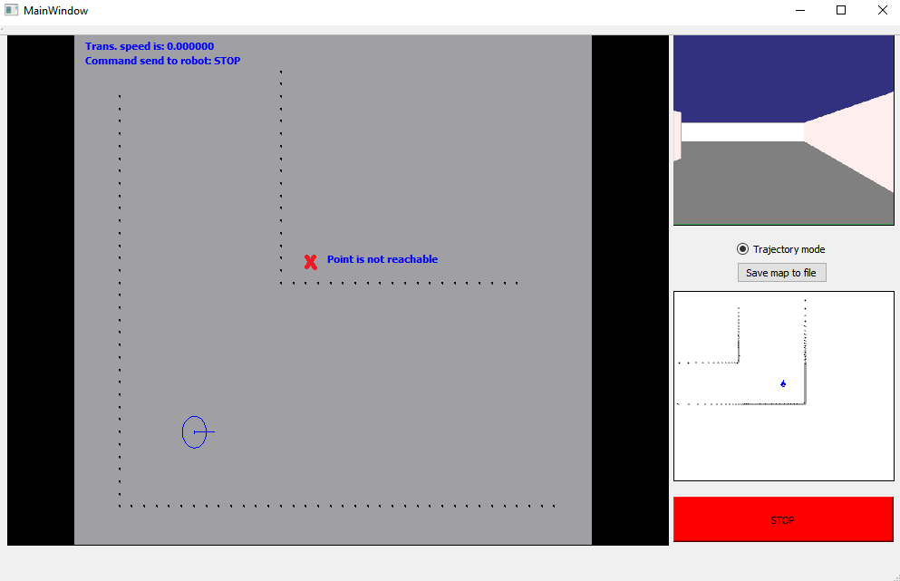
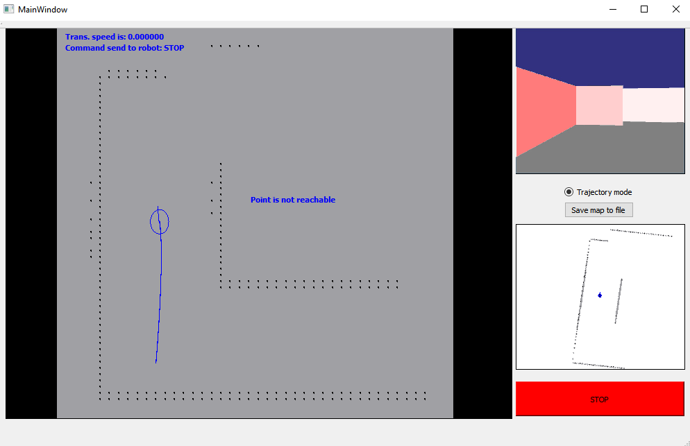

# HMI #

Táto úloha je implementovaná do demo príkladu, ktorý sme dostali ako podklad k predmetu.

## Zadanie ##

    Semi-autonómne riadenie robota. Používateľ má možnosť vybrať bod na mape, kam sa robot
    dokáže dostať autonómne. Ak bod nie je dosiahnuteľný, zobrazí túto správu operátorovi.

### Používateľské prostredie ###

    Hlavným prvkom HMI je obraz mapy vytvorenej robotom. Tento obraz je škáľovaný na základe veľ-
    kosti preskúmanej oblasti, t.j. čím väčšiu oblasť robot zmapoval, tým väčšie oddialenie je
    aplikované na obraz. V ľavej hornej časti tejto hlavnej obrazovky sa nachádza malý info-panel.
    Sú tu zobrazené dve informácie - aký príkaz robot autonómne vykonáva a akou translačnou rých-
    losťou sa pohybuje. V pravej časti HMI máme možnosť si zvoliť, či chceme, aby robot snímal svoju
    trajektóriu, alebo nie. Ak je táto možnosť zakliknutá, na obraze mapy sa vykresluje aj prejdená
    trajektória robota. Poslednou informáciou, ktorá sa v obraze mapy zobrazuje je, či bod, ktorý 
    sme kliknutím zvolili, je dosiahnuteľný. Ak vyberieme kliknutím bod na mape, kam sa robot
    nevie priamo dostať, zobrazí sa nám upozornenie.
    Môžeme to vidieť aj na tomto obrázku (červeným krížikom je znázornený bod kliknutia):

    Ak je zoskenovaná väčšia oblasť, obraz mapy sa oddiali, aby zobrazil celú mapu. Aktuálna mapa
    teda vždy zaberá celú plochu obrazu.

    Aby sa zachoval rovnaký pomer strán obrazu, používam "black bary". Tie vyplnia plochu tak,
    aby mal obraz vždy rovnaký pomer šírka/výška.

    V pravej časti HMI máme následne ďaľšie dve obrazovky. Jedna zobrazuje obraz kamery umiestnenej
    na robotovi s fúziou dát o blízkosti steny, druhá zobrazuje lidarové dáta. V obrazovke s lidarovými
    dátami máme možnosť vidieť aj pozíciu a natočenie robota. Takisto môžeme vybrať želaný bod aj v tejto
    obrazovke.
    Veľmi dôležité je tlačidlo STOP, čo je tlačidlo centrálneho zastavenia. Po jeho stlačení robot zastane.
    Keďže sa jedná o riadenie s oneskorením, trvá určitú dobu, kým sa príkaz dostane k robotovi.

    Operátor má možnosť exportovať mapu prostredia tlačidlom "Save map to file". Mapa sa uloží vo formáte
    textové súbora do Build priečinku projektu.

### Ovládanie ###

    Robot sa naviguje autonómne, teda celý algoritmus regulácie k žiadanému bodu sa vykonáva v robotovi.
    Je to z dôvodu, že prenos dát medzi robotom a HMI obsahuje oneskorenie, čo by spôsobovalo veľké nepres-
    nosti. Tým pádom každý signál poslaný do robota má oneskorenie a všetky ifnormácie, ktoré vidíme na HMI,
    sú taktiež oneskorené. Možnosti ovládania:

- centrálne tlačidlo STOP

- pomocou AWSD na klávesnici

- pomocou výberu bodu kliknutím:
    a) do hlavného obrazu obsahujúceho mapu
    b) do obrazu s lidarovými dátami